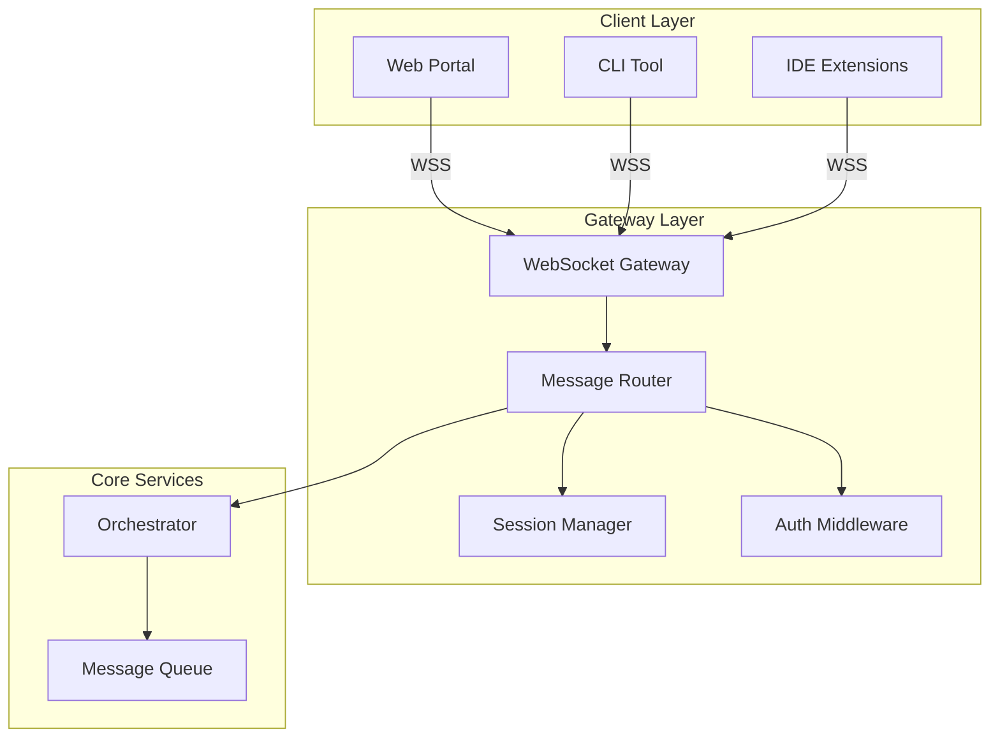

# Phase 1: Core Infrastructure

## Overview
Establish the foundational communication layer with WebSocket gateway, message routing, and session management.

## Architecture Diagram

## Components

### WebSocket Gateway
- Connection management
- Heartbeat monitoring
- Message serialization
- Compression support

### Message Router
- Command parsing
- Service routing
- Response aggregation
- Error handling

### Session Manager
- Session creation/tracking
- Connection pooling
- State persistence
- Timeout handling

### Authentication
- JWT token validation
- API key management
- Rate limiting
- Security headers

## Implementation Steps

1. **Setup Base Project**
   - Create .NET 8 solution (C# backend)
   - Create Nx.dev workspace (TypeScript frontend)
   - Configure minimal APIs
   - Setup dependency injection

2. **WebSocket Gateway**
   - Implement connection handler
   - Add heartbeat mechanism
   - Setup message protocol

3. **Message Routing**
   - Define message schema
   - Implement command parser
   - Create routing table

4. **Session Management**
   - Implement session store
   - Add connection pooling
   - Configure timeouts

5. **Authentication Layer**
   - JWT implementation
   - Rate limiter setup
   - Security middleware

## Key Files
- `Gateway/WebSocketHandler.cs`
- `Gateway/MessageRouter.cs`
- `Services/SessionManager.cs`
- `Middleware/AuthMiddleware.cs`

## Dependencies
- ASP.NET Core 8
- System.Threading.Channels
- Microsoft.AspNetCore.WebSockets

## Success Criteria
- [ ] WebSocket connections established
- [ ] Messages routed correctly
- [ ] Sessions persisted
- [ ] Authentication working
- [ ] 100ms message latency