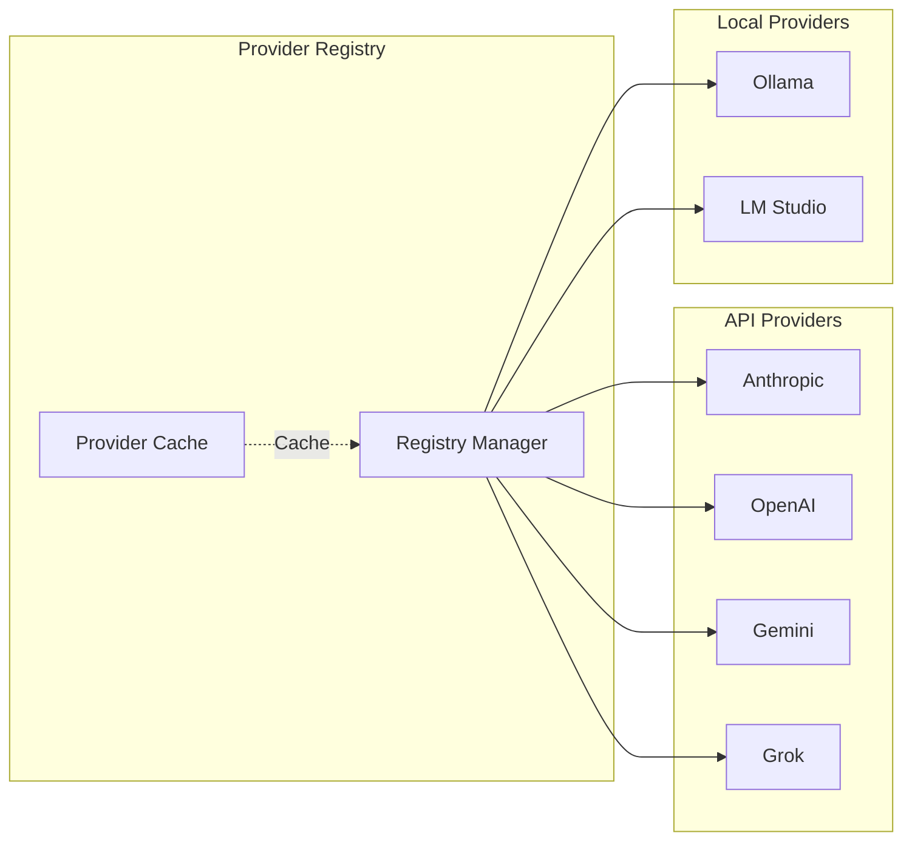

# Phase 2: Provider Management

## Overview
Implement the provider abstraction layer supporting multiple LLM providers with unified interfaces.

## Provider Architecture


## Provider Contract
```csharp
public interface ILLMProvider
{
    string Name { get; }
    Task<bool> ConnectAsync(ProviderConfig config);
    Task<MCPResponse> SendMessageAsync(MCPMessage message);
    Task<IEnumerable<Model>> GetModelsAsync();
}
```

## Implementation Steps

1. **Provider Registry**
   - Create provider interface
   - Implement registry service
   - Add provider discovery

2. **API Provider Adapters**
   - Anthropic adapter
   - OpenAI adapter
   - Gemini adapter
   - Authentication handling

3. **Local Provider Adapters**
   - Ollama integration
   - LM Studio support
   - Model detection

4. **Provider Selection**
   - Load balancing logic
   - Fallback mechanism
   - Cost optimization

5. **Configuration Management**
   - Provider settings
   - Model configurations
   - API key storage

## Key Files
- `Providers/ILLMProvider.cs`
- `Providers/ProviderRegistry.cs`
- `Providers/Anthropic/AnthropicProvider.cs`
- `Providers/Ollama/OllamaProvider.cs`

## Configuration
```yaml
providers:
  anthropic:
    endpoint: https://api.anthropic.com
    models: [claude-3-opus, claude-3-sonnet]
  ollama:
    endpoint: http://localhost:11434
    models: [codellama, mixtral]
```

## Success Criteria
- [ ] Provider registry operational
- [ ] 3+ providers integrated
- [ ] Model detection working
- [ ] Fallback mechanism tested
- [ ] Configuration persisted