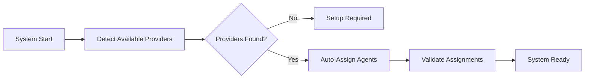
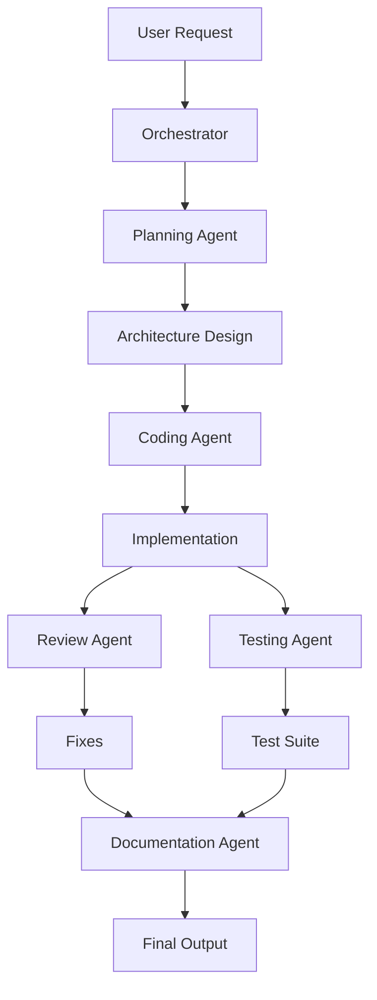

# Phase 3: Agent System

## Overview
Build the multi-agent coordination system with specialized agents for different development tasks. The system works transparently with automatic defaults - users can start immediately without any agent configuration.

## Default Behavior (Zero Configuration)
When a user starts without configuring agents:
- All agent roles use the same provider/model the user has configured
- The system adjusts temperature and parameters per task type automatically
- Workflow proceeds seamlessly without user intervention

## Agent Setup Phase


## Agent Workflow


## Agent Types

### Planning Agent
- Requirements analysis
- Architecture design
- Task breakdown
- **Recommended:** High-capability models (Claude Opus, GPT-4, Gemini Ultra)

### Coding Agent
- Code generation
- Feature implementation
- Refactoring
- **Recommended:** Code-specialized models (GPT-4, CodeLlama, Claude)

### Review Agent
- Code quality checks
- Security review
- Best practices
- **Recommended:** Analytical models (Claude, GPT-4)

### Testing Agent
- Unit test generation
- Integration tests
- Test coverage
- **Recommended:** Fast, thorough models (Gemini, GPT-3.5, Mixtral)

### Documentation Agent
- API documentation
- User guides
- Code comments
- **Recommended:** Cost-effective models (Mistral, Cohere, local models)

## Dynamic Agent Assignment

### Zero-Configuration Mode
```csharp
public class AgentAssigner
{
    public Dictionary<AgentType, ILLMProvider> AssignAgents(
        List<ILLMProvider> providers, 
        WorkflowConfig userConfig = null)
    {
        // If user hasn't configured agents, use simple defaults
        if (userConfig?.AgentAssignments == null)
        {
            var defaultProvider = providers.FirstOrDefault() 
                ?? throw new NoProvidersException();
                
            // All agents use same provider with task-specific parameters
            return CreateDefaultAssignments(defaultProvider);
        }
        
        // User has custom configuration
        return ApplyUserConfiguration(userConfig, providers);
    }
    
    private Dictionary<AgentType, AgentConfig> CreateDefaultAssignments(
        ILLMProvider provider)
    {
        return new Dictionary<AgentType, AgentConfig>
        {
            [AgentType.Planning] = new AgentConfig(provider, temperature: 0.7),
            [AgentType.Coding] = new AgentConfig(provider, temperature: 0.3),
            [AgentType.Review] = new AgentConfig(provider, temperature: 0.2),
            [AgentType.Testing] = new AgentConfig(provider, temperature: 0.1),
            [AgentType.Documentation] = new AgentConfig(provider, temperature: 0.5)
        };
    }
}
```

### Assignment Strategy
```yaml
# Priority-based assignment when multiple providers available
assignment_strategy:
  planning:
    priority: [anthropic, openai, gemini, local]
    capability_required: high_reasoning
    
  coding:
    priority: [openai, anthropic, local_code_models]
    capability_required: code_generation
    
  review:
    priority: [anthropic, openai, gemini]
    capability_required: analysis
    
  testing:
    priority: [gemini, openai, mistral, local]
    capability_required: fast_iteration
    
  documentation:
    priority: [mistral, cohere, local, any]
    capability_required: text_generation
```

## Implementation Steps

1. **Agent Setup Service**
   - Provider detection
   - Capability assessment
   - Dynamic assignment
   - Fallback handling

2. **Agent Base Class**
   - Define agent interface
   - Context management
   - Provider abstraction

3. **Orchestrator Service**
   - Command interpretation
   - Agent selection
   - Workflow execution

4. **Agent Implementations**
   - Planning agent
   - Coding agent
   - Review agent
   - Testing agent
   - Documentation agent

5. **Coordination Logic**
   - Sequential execution
   - Parallel processing
   - Result aggregation

6. **Context Management**
   - Token allocation
   - History tracking
   - State persistence

## Key Files
- `Agents/AgentSetupService.cs`
- `Agents/IAgent.cs`
- `Agents/AgentOrchestrator.cs`
- `Agents/PlanningAgent.cs`
- `Agents/CodingAgent.cs`
- `Services/ContextManager.cs`

## Success Criteria
- [ ] Provider detection working
- [ ] Agents dynamically assigned
- [ ] Single-provider mode supported
- [ ] All 5 agents implemented
- [ ] Orchestrator routing correctly
- [ ] Context preserved between agents
- [ ] Parallel execution working
- [ ] Results aggregated properly