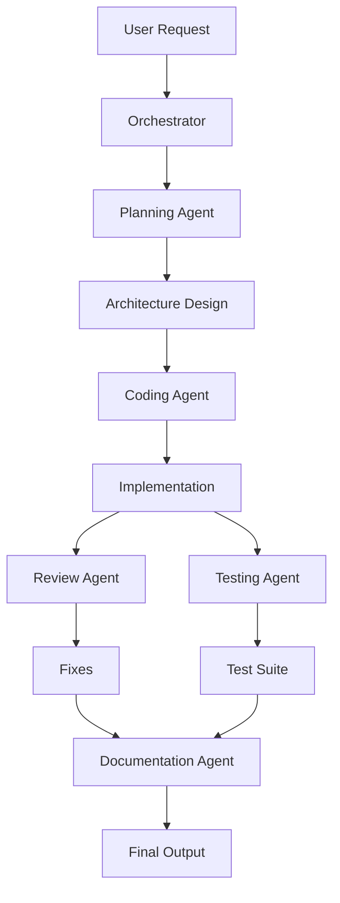

# Phase 3: Agent System

## Overview
Build the multi-agent coordination system with specialized agents for different development tasks.

## Agent Workflow

## Agent Types

### Planning Agent
- Requirements analysis
- Architecture design
- Task breakdown
- **Default:** Claude 3 Opus

### Coding Agent
- Code generation
- Feature implementation
- Refactoring
- **Default:** GPT-4 Turbo

### Review Agent
- Code quality checks
- Security review
- Best practices
- **Default:** Claude 3 Sonnet

### Testing Agent
- Unit test generation
- Integration tests
- Test coverage
- **Default:** Gemini Pro

### Documentation Agent
- API documentation
- User guides
- Code comments
- **Default:** Mistral Large

## Implementation Steps

1. **Agent Base Class**
   - Define agent interface
   - Context management
   - Provider assignment

2. **Orchestrator Service**
   - Command interpretation
   - Agent selection
   - Workflow execution

3. **Agent Implementations**
   - Planning agent
   - Coding agent
   - Review agent
   - Testing agent
   - Documentation agent

4. **Coordination Logic**
   - Sequential execution
   - Parallel processing
   - Result aggregation

5. **Context Management**
   - Token allocation
   - History tracking
   - State persistence

## Key Files
- `Agents/IAgent.cs`
- `Agents/AgentOrchestrator.cs`
- `Agents/PlanningAgent.cs`
- `Agents/CodingAgent.cs`
- `Services/ContextManager.cs`

## Success Criteria
- [ ] All 5 agents implemented
- [ ] Orchestrator routing correctly
- [ ] Context preserved between agents
- [ ] Parallel execution working
- [ ] Results aggregated properly