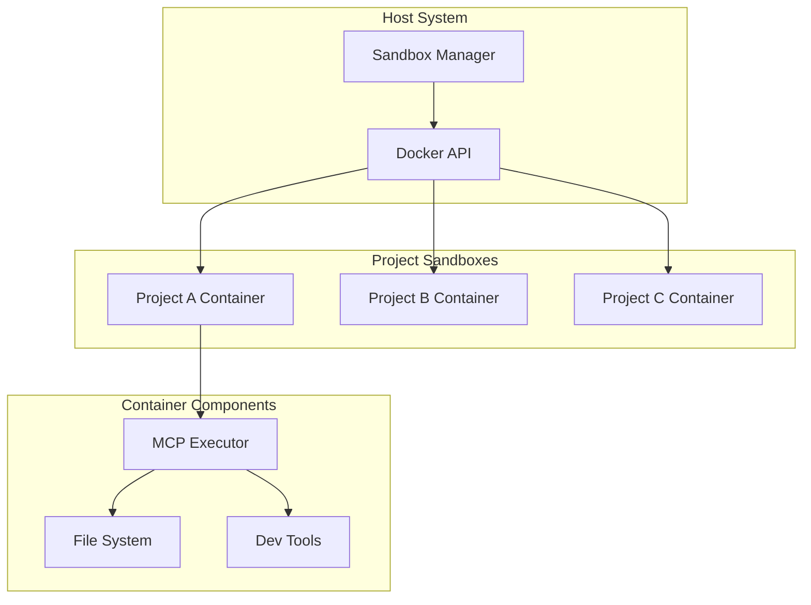

# Phase 4: Docker Sandbox

## Overview
Implement isolated Docker containers for secure code execution with MCP protocol support.

## Sandbox Architecture


## Security Levels

### Full Isolation
- No network access
- Read-only filesystem
- Minimal capabilities

### Development
- Local network access
- Read-write filesystem
- Standard capabilities

### Build
- Package manager access
- Build tools enabled
- Extended capabilities

### Production
- Full network access
- Custom configuration
- All capabilities

## Implementation Steps

1. **Sandbox Manager**
   - Container creation
   - Lifecycle management
   - Resource limits

2. **MCP Agent Executor**
   - Tool registration
   - Command execution
   - File operations

3. **Docker Integration**
   - Docker API client
   - Volume management
   - Network configuration

4. **Security Configuration**
   - Capability dropping
   - Seccomp profiles
   - AppArmor/SELinux

5. **Container Templates**
   - Base sandbox image
   - Language-specific images
   - Tool installations

## Key Files
- `Sandbox/SandboxManager.cs`
- `Sandbox/MCPExecutor.cs`
- `Sandbox/DockerClient.cs`
- `Dockerfile.sandbox`

## Container Specification
```dockerfile
FROM mcr.microsoft.com/dotnet/sdk:8.0
WORKDIR /workspace
RUN apt-get update && apt-get install -y git nodejs npm python3
COPY agent-executor /usr/local/bin/
ENV MCP_MODE=sandbox
ENTRYPOINT ["agent-executor"]
```

## Success Criteria
- [ ] Containers created/destroyed
- [ ] MCP executor operational
- [ ] File operations working
- [ ] Security levels enforced
- [ ] Resource limits applied