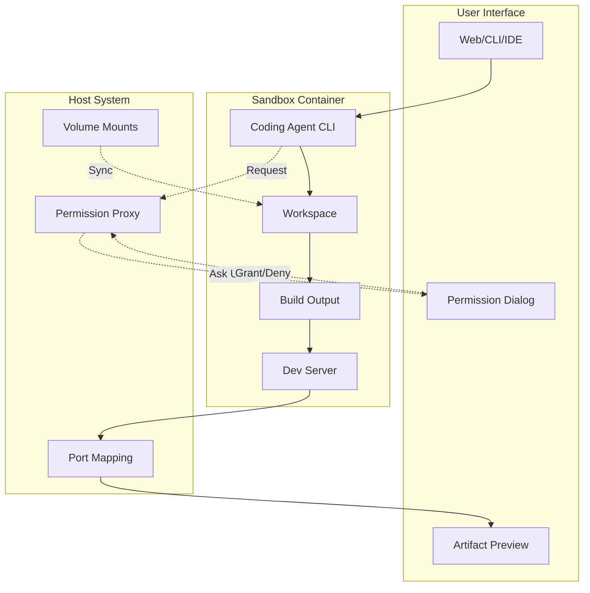

# Phase 4: Docker Sandbox

## Overview
Provide isolated Docker containers where coding agents execute tasks. Each sandbox includes a full development environment with the ability to build applications and present artifacts to users.

## Sandbox Architecture

## Sandbox Capabilities

### Agent Access
The coding agent running in the sandbox has access to:
- **Workspace**: Full read/write to `/workspace` directory
- **Tools**: Language runtimes, build tools, package managers
- **Execution**: Ability to run builds, tests, and development servers
- **Output**: Can generate artifacts and expose them via ports

### Permission Requests
Certain agent operations require user approval:
- **Network Access**: External API calls, package downloads
- **Port Exposure**: Opening ports for preview
- **Resource Increase**: Memory/CPU limit changes
- **File System**: Access outside workspace

All permission requests are proxied through the user's interface (web UI, CLI, IDE) for explicit approval.

### Artifact Presentation

| Artifact Type | Presentation Method |
|--------------|-------------------|
| Web Application | Port forwarding to browser preview |
| API Service | Exposed endpoint with documentation |
| Static Files | Direct file access via volumes |
| Build Output | Downloaded as archive |
| Logs/Reports | Streamed to UI |

### Security Boundaries

| Component | Access Level |
|-----------|-------------|
| Workspace | Full access |
| System Files | Read-only |
| Network | Configurable (default: package managers only) |
| Host System | No access |
| Other Containers | Isolated |

### Resource Limits (User Configurable)

| Resource | Default | Minimum | Maximum |
|----------|---------|---------|---------|
| CPU Cores | 2 | 0.5 | Host available |
| Memory | 2GB | 512MB | Host available |
| Disk Space | 10GB | 1GB | 100GB |
| Max Processes | 100 | 10 | 1000 |
| Network Bandwidth | Unlimited | 1Mbps | Unlimited |

## Permission Flow

When the sandbox agent needs elevated permissions:
1. Agent requests permission via proxy
2. Request forwarded to user interface
3. User sees permission dialog with context
4. User approves or denies request
5. Decision sent back to agent
6. Agent proceeds or handles denial

## Implementation Steps

1. **Container Environment**
   - Base image with development tools
   - Coding agent CLI installation
   - Workspace volume setup

2. **Permission Proxy**
   - Request interception
   - User interface integration
   - Permission caching

3. **Agent Integration**
   - Non-interactive agent mode
   - Permission-aware execution
   - Graceful denial handling

4. **Artifact Handling**
   - Port mapping for web apps
   - File synchronization
   - Build output management

5. **User Experience**
   - Clear permission dialogs
   - Live preview capability
   - Activity monitoring

## Key Files
- `Sandbox/SandboxManager.cs`
- `Sandbox/AgentRunner.cs`
- `Sandbox/ArtifactServer.cs`
- `Dockerfile.sandbox`

## Container Contents

The sandbox container includes:
- Development runtimes (Node.js, Python, .NET, etc.)
- Build tools (npm, pip, dotnet, make)
- The coding agent CLI in non-interactive mode
- Port exposure for artifact preview
- Volume mount for workspace persistence

## Success Criteria
- [ ] Agent can execute in sandbox
- [ ] Workspace files accessible
- [ ] Web apps previewable
- [ ] Artifacts downloadable
- [ ] Security boundaries enforced
- [ ] Resource limits applied