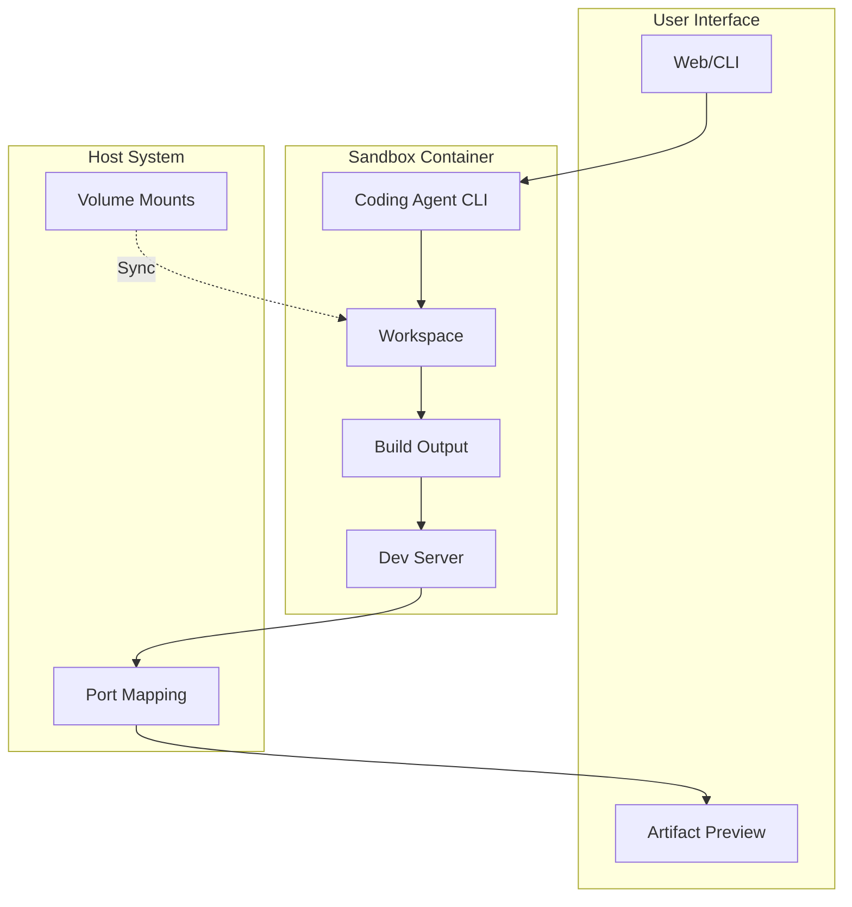

# Phase 4: Docker Sandbox

## Overview
Provide isolated Docker containers where coding agents execute tasks. Each sandbox includes a full development environment with the ability to build applications and present artifacts to users.

## Sandbox Architecture

## Sandbox Capabilities

### Agent Access
The coding agent running in the sandbox has access to:
- **Workspace**: Full read/write to `/workspace` directory
- **Tools**: Language runtimes, build tools, package managers
- **Execution**: Ability to run builds, tests, and development servers
- **Output**: Can generate artifacts and expose them via ports

### Artifact Presentation

| Artifact Type | Presentation Method |
|--------------|-------------------|
| Web Application | Port forwarding to browser preview |
| API Service | Exposed endpoint with documentation |
| Static Files | Direct file access via volumes |
| Build Output | Downloaded as archive |
| Logs/Reports | Streamed to UI |

### Security Boundaries

| Component | Access Level |
|-----------|-------------|
| Workspace | Full access |
| System Files | Read-only |
| Network | Configurable (default: package managers only) |
| Host System | No access |
| Other Containers | Isolated |

## Implementation Steps

1. **Container Environment**
   - Base image with development tools
   - Coding agent CLI installation
   - Workspace volume setup

2. **Agent Integration**
   - Non-interactive agent mode
   - Command execution interface
   - Output capture and streaming

3. **Artifact Handling**
   - Port mapping for web apps
   - File synchronization
   - Build output management

4. **Security Configuration**
   - Network restrictions
   - Resource limits
   - Process isolation

5. **User Experience**
   - Live preview capability
   - File browser access
   - Log streaming

## Key Files
- `Sandbox/SandboxManager.cs`
- `Sandbox/AgentRunner.cs`
- `Sandbox/ArtifactServer.cs`
- `Dockerfile.sandbox`

## Container Contents

The sandbox container includes:
- Development runtimes (Node.js, Python, .NET, etc.)
- Build tools (npm, pip, dotnet, make)
- The coding agent CLI in non-interactive mode
- Port exposure for artifact preview
- Volume mount for workspace persistence

## Success Criteria
- [ ] Agent can execute in sandbox
- [ ] Workspace files accessible
- [ ] Web apps previewable
- [ ] Artifacts downloadable
- [ ] Security boundaries enforced
- [ ] Resource limits applied