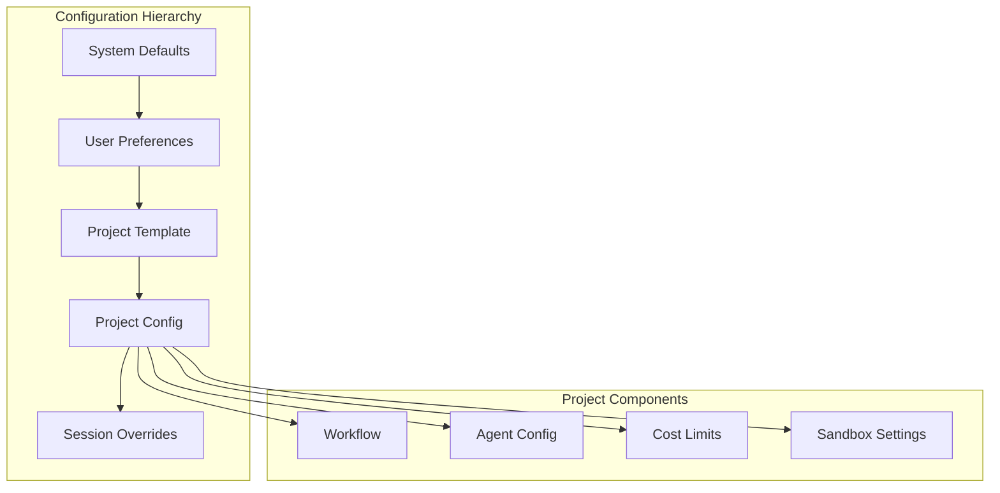

# Phase 5: Project Management

## Overview
Implement project configuration system with optional workflow templates and cost tracking. Projects work out-of-the-box with zero configuration required.

## Project Structure

## Configuration Management

### Configuration Levels

| Level | Required | Description |
|-------|----------|-------------|
| Minimal | Yes | Project name only |
| Basic | No | Add provider selection |
| Advanced | No | Custom workflows and agents |
| Expert | No | Full template customization |

### Default Behaviors

When no configuration is provided:
- **Workflow**: Simple 3-stage process (plan → implement → review)
- **Agents**: All use same provider with optimized parameters
- **Limits**: Reasonable defaults based on provider
- **Sandbox**: Auto-configured based on project type

### Optional Templates

| Template | Focus | Best For |
|----------|-------|----------|
| Standard | Balanced approach | Most projects |
| Fast | Speed over perfection | Prototypes |
| Quality | Thorough review | Production code |
| Budget | Cost optimization | Limited resources |

## Implementation Steps

1. **Project Service**
   - Project CRUD operations
   - Configuration management
   - Template system

2. **Configuration Inheritance**
   - Hierarchy implementation
   - Override mechanism
   - Merge strategies

3. **Workflow Engine**
   - Stage execution
   - Parallel processing
   - Conditional logic

4. **Cost Tracking**
   - Token counting
   - Price calculation
   - Budget enforcement

5. **Template System**
   - Built-in templates
   - Custom templates
   - Template validation

## Key Files
- `Projects/ProjectService.cs`
- `Projects/ConfigurationManager.cs`
- `Projects/WorkflowEngine.cs`
- `Projects/CostTracker.cs`

## Configuration Examples

| User Type | Required Fields | Optional Fields |
|-----------|----------------|-----------------|
| New User | project name | (none) |
| Regular User | project name, provider | template |
| Power User | project name, provider | workflow, agents |
| Enterprise | project name, provider | all customization |

## Success Criteria
- [ ] Projects created/managed
- [ ] Configuration inherited correctly
- [ ] Workflows executing
- [ ] Costs tracked accurately
- [ ] Templates applied properly