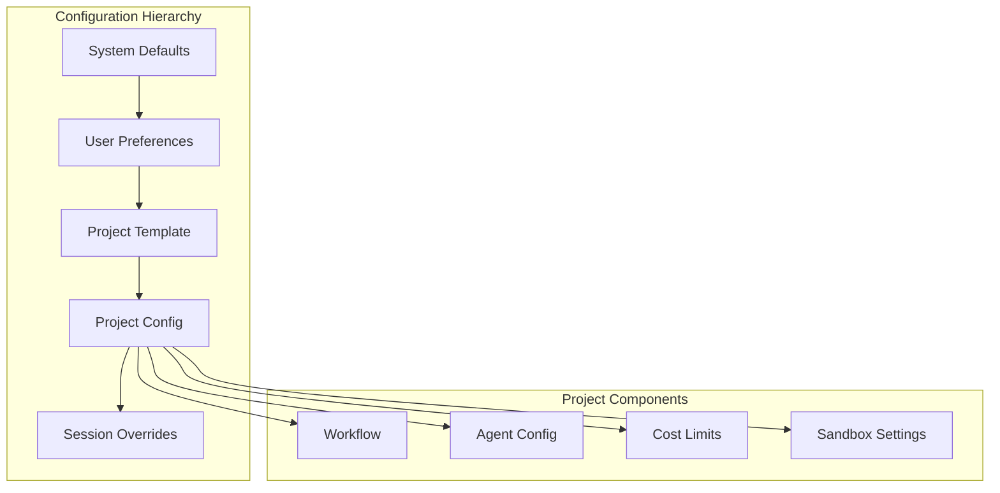

# Phase 5: Project Management

## Overview
Implement project configuration system with workflow templates and cost tracking.

## Project Structure


## Configuration Management

### System Defaults
- Base workflow template
- Default agent assignments
- Global cost limits

### Project Configuration
- Custom workflows
- Provider overrides
- Project-specific limits

### Workflow Templates
- Standard development
- Fast iteration
- Quality focused
- Budget optimized

## Implementation Steps

1. **Project Service**
   - Project CRUD operations
   - Configuration management
   - Template system

2. **Configuration Inheritance**
   - Hierarchy implementation
   - Override mechanism
   - Merge strategies

3. **Workflow Engine**
   - Stage execution
   - Parallel processing
   - Conditional logic

4. **Cost Tracking**
   - Token counting
   - Price calculation
   - Budget enforcement

5. **Template System**
   - Built-in templates
   - Custom templates
   - Template validation

## Key Files
- `Projects/ProjectService.cs`
- `Projects/ConfigurationManager.cs`
- `Projects/WorkflowEngine.cs`
- `Projects/CostTracker.cs`

## Project Configuration
```yaml
project:
  name: "My Project"
  template: "standard"
  workflow:
    stages: [planning, coding, review, testing]
  agents:
    planning: anthropic/claude-3-opus
    coding: openai/gpt-4-turbo
  limits:
    cost: 25.00
    timeout: 300
```

## Success Criteria
- [ ] Projects created/managed
- [ ] Configuration inherited correctly
- [ ] Workflows executing
- [ ] Costs tracked accurately
- [ ] Templates applied properly