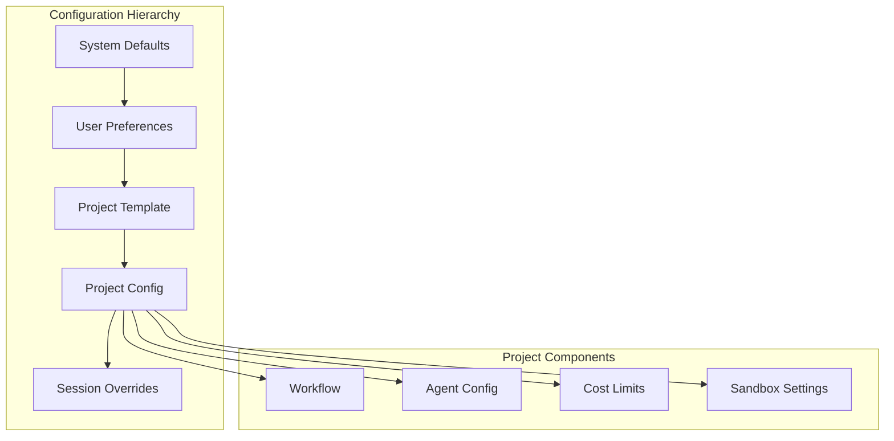

# Phase 5: Project Management

## Overview
Implement project configuration system with optional workflow templates and cost tracking. Projects work out-of-the-box with zero configuration required.

## Project Structure


## Configuration Management

### Zero Configuration (Default)
```csharp
public class ProjectService
{
    public async Task<Project> CreateProject(string name, string sourcePath)
    {
        // User can create a project with just a name and path
        return new Project
        {
            Name = name,
            SourcePath = sourcePath,
            // Everything else uses intelligent defaults
            Workflow = GetDefaultWorkflow(),
            AgentConfig = null, // Will use automatic assignment
            CostLimit = GetDefaultCostLimit()
        };
    }
    
    private Workflow GetDefaultWorkflow()
    {
        // Simple, effective default workflow
        return new Workflow
        {
            Stages = new[] { "plan", "implement", "review" },
            AutoProceed = true
        };
    }
}
```

### System Defaults (Fallback)
- Base workflow template (if not specified)
- Automatic agent assignments
- Reasonable cost limits

### Optional Project Configuration
- Custom workflows (advanced users)
- Provider overrides (power users)
- Project-specific limits

### Optional Workflow Templates
- Standard development
- Fast iteration
- Quality focused
- Budget optimized
- Custom user templates

## Implementation Steps

1. **Project Service**
   - Project CRUD operations
   - Configuration management
   - Template system

2. **Configuration Inheritance**
   - Hierarchy implementation
   - Override mechanism
   - Merge strategies

3. **Workflow Engine**
   - Stage execution
   - Parallel processing
   - Conditional logic

4. **Cost Tracking**
   - Token counting
   - Price calculation
   - Budget enforcement

5. **Template System**
   - Built-in templates
   - Custom templates
   - Template validation

## Key Files
- `Projects/ProjectService.cs`
- `Projects/ConfigurationManager.cs`
- `Projects/WorkflowEngine.cs`
- `Projects/CostTracker.cs`

## Project Configuration Examples

### Minimal Configuration (Most Users)
```yaml
# User only needs to specify project name
project:
  name: "My Project"
  # Everything else is automatic
```

### Advanced Configuration (Power Users)
```yaml
project:
  name: "My Project"
  template: "standard"  # Optional
  workflow:  # Optional custom workflow
    stages: [planning, coding, review, testing]
  agents:  # Optional agent overrides
    planning: anthropic/claude-3-opus
    coding: openai/gpt-4-turbo
  limits:  # Optional limits
    cost: 25.00
    timeout: 300
```

## Success Criteria
- [ ] Projects created/managed
- [ ] Configuration inherited correctly
- [ ] Workflows executing
- [ ] Costs tracked accurately
- [ ] Templates applied properly