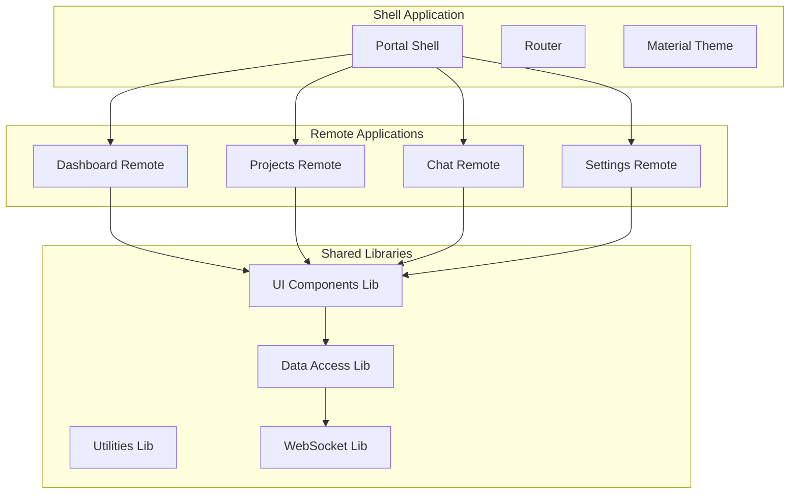

# Phase 6: Web Portal

## Overview
Build the web-based user interface using Nx.dev monorepo with Module Federation, Angular Material components, and strict architectural standards.

## Nx Monorepo Architecture


## Module Federation Structure

| Application | Purpose | Route |
|------------|---------|-------|
| Shell | Main container, routing, theme | / |
| Dashboard | Metrics, status, overview | /dashboard |
| Projects | Project management | /projects |
| Chat | Agent interaction | /chat |
| Settings | Configuration | /settings |

## Angular Material Standards

| UI Element | Material Component | Library Location |
|------------|-------------------|------------------|
| Forms | mat-form-field | libs/ui/forms |
| Tables | mat-table | libs/ui/tables |
| Navigation | mat-sidenav | libs/ui/navigation |
| Dialogs | mat-dialog | libs/ui/dialogs |
| Cards | mat-card | libs/ui/cards |
| Buttons | mat-button | libs/ui/buttons |

## Internationalization (i18n)

### Localization Requirements

| Requirement | Implementation |
|------------|---------------|
| All text | Use Angular i18n pipe |
| Date/Time | locale-aware formatting |
| Numbers | locale-specific formats |
| Currency | locale currency display |
| RTL Support | Material RTL theming |
| Pluralization | ICU message format |

### Translation Structure
```
libs/i18n/
├── locales/
│   ├── en-US.json    # English (US)
│   ├── es-ES.json    # Spanish
│   ├── fr-FR.json    # French
│   ├── de-DE.json    # German
│   ├── ja-JP.json    # Japanese
│   └── ar-SA.json    # Arabic (RTL)
└── services/
    └── translation.service.ts
```

## Component Guidelines

### File Structure
- No file exceeds 100 lines
- Logical separation of concerns
- One component per file
- Shared components in libs

### Theming
- Use Angular Material theming system
- No hardcoded colors
- Support light/dark modes
- Custom components follow theme

### Localization Rules
- No hardcoded strings in templates
- All text through i18n pipe
- Date formatting via DatePipe with locale
- Number formatting via DecimalPipe with locale
- Validation messages localized
- Aria labels localized for accessibility

### Reusable Components
All components built as standalone, reusable units in library projects:
- Form controls in `libs/ui/forms`
- Data displays in `libs/ui/data`
- Layout components in `libs/ui/layout`
- Custom directives in `libs/ui/directives`
- Translation service in `libs/i18n`

## Implementation Steps

1. **Nx Workspace Setup**
   - Initialize Nx monorepo
   - Configure Module Federation
   - Setup Angular Material
   - Configure theming system

2. **Shell Application**
   - Main container setup
   - Router configuration
   - Remote loading
   - Theme provider

3. **Remote Applications**
   - Dashboard remote
   - Projects remote
   - Chat remote
   - Settings remote

4. **Shared Libraries**
   - UI component library
   - Data access library
   - WebSocket service
   - Utility functions

5. **Material Integration**
   - Theme configuration
   - Component setup
   - Custom components
   - Responsive design

## Project Structure
```
apps/
├── shell/                 # Main container app
├── dashboard/            # Dashboard micro-frontend
├── projects/             # Projects micro-frontend
├── chat/                 # Chat micro-frontend
└── settings/             # Settings micro-frontend

libs/
├── ui/
│   ├── forms/           # Form components
│   ├── tables/          # Table components
│   ├── cards/           # Card components
│   └── theme/           # Theme configuration
├── data-access/         # API services
├── websocket/           # WebSocket service
└── utils/               # Shared utilities
```

## Development Standards

| Standard | Requirement |
|----------|------------|
| File Size | Max 100 lines per file |
| Components | Standalone and reusable |
| Styling | Material theming only |
| State | NgRx or Akita |
| Testing | 80% coverage minimum |
| Accessibility | WCAG 2.1 AA compliant |
| i18n | All text localized |
| RTL | Full RTL support |
| Locales | Minimum 6 languages |

## Success Criteria
- [ ] Nx workspace configured
- [ ] Module Federation working
- [ ] All Material components integrated
- [ ] Theme system implemented
- [ ] Libraries properly structured
- [ ] Remote apps loading correctly
- [ ] i18n fully implemented
- [ ] RTL support verified
- [ ] All strings externalized