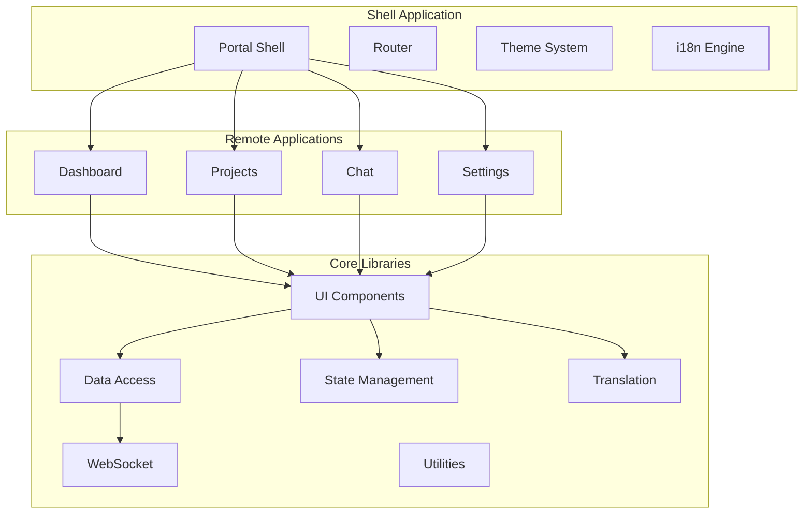

# Phase 6: Web Portal (Overview)

## Summary
Phase 6 implements the web-based user interface using Nx.dev monorepo with Module Federation, Angular Material components, comprehensive internationalization, and advanced theming. Due to the complexity and scope, this phase has been divided into four sub-phases.

## UI Mockups
Complete MockML mockups for all portal interfaces are available in `docs/mockups/`:
- **Shell**: Main container layout with navigation
- **Dashboard**: System metrics and monitoring interfaces  
- **Projects**: Project management and configuration screens
- **Chat**: Agent interaction and chat interfaces
- **Settings**: Configuration and profile management pages

## Sub-Phases

### [Phase 6a: Foundation & Shell Setup](06a-foundation-shell.md)
- Nx workspace initialization with Angular preset
- Module Federation configuration for micro-frontends
- Shell application with navigation and routing
- Angular Material integration and base theme setup
- Development tooling (ESLint, Prettier) configuration

### [Phase 6b: Core Libraries & Services](06b-core-libraries.md)
- Reusable UI component libraries (forms, tables, cards, navigation, dialogs)
- Data access layer with API services
- WebSocket service for real-time communication
- State management service
- Utility functions and validators

### [Phase 6c: Remote Applications](06c-remote-applications.md)
- Dashboard remote for metrics and status monitoring
- Projects remote for project management interface
- Chat remote for agent interactions
- Settings remote for configuration management
- Module Federation remote configuration

### [Phase 6d: Internationalization & Theming](06d-i18n-theming.md)
- Angular i18n setup with 8+ languages
- RTL support for Arabic and Hebrew
- Dynamic theme switching (light/dark/custom)
- Locale-aware formatting utilities
- Translation management system

## Architecture Overview



## Key Technologies

| Technology | Purpose |
|------------|---------|
| Nx.dev | Monorepo management and tooling |
| Module Federation | Micro-frontend architecture |
| Angular 17+ | Frontend framework |
| Angular Material | UI component library |
| Angular i18n | Internationalization |
| WebSocket | Real-time communication |
| RxJS | Reactive programming |
| SCSS | Styling with theming support |

## Implementation Order

1. **Phase 6a** - Foundation & Shell Setup (Required first)
2. **Phase 6b** - Core Libraries & Services (Required second)
3. **Phase 6c** - Remote Applications (Can run parallel with 6d)
4. **Phase 6d** - Internationalization & Theming (Can run parallel with 6c)

## Project Structure

```
src/frontend/
├── apps/
│   ├── shell/              # Main container application
│   ├── dashboard/          # Dashboard micro-frontend
│   ├── projects/           # Projects micro-frontend
│   ├── chat/              # Chat micro-frontend
│   └── settings/          # Settings micro-frontend
├── libs/
│   ├── ui/
│   │   ├── forms/         # Form components
│   │   ├── tables/        # Table components
│   │   ├── cards/         # Card components
│   │   ├── navigation/    # Navigation components
│   │   ├── dialogs/       # Dialog components
│   │   └── theme/         # Theme configuration
│   ├── data-access/       # API services
│   ├── websocket/         # WebSocket service
│   ├── state/             # State management
│   ├── i18n/              # Translation services
│   └── utils/             # Shared utilities
├── angular.json
├── nx.json
├── tsconfig.json
└── package.json
```

## Development Standards

| Standard | Requirement |
|----------|------------|
| Component Size | Maximum 100 lines per file |
| Component Type | Standalone, OnPush change detection |
| Styling | Material theming only, no hardcoded colors |
| State Management | Centralized via AppStateService |
| Testing Coverage | Minimum 80% |
| Accessibility | WCAG 2.1 AA compliant |
| Internationalization | All text externalized |
| RTL Support | Full support for Arabic/Hebrew |
| Supported Languages | 8+ languages minimum |

## Dependencies

### Core Dependencies
```json
{
  "@angular/core": "^17.0.0",
  "@angular/material": "^17.0.0",
  "@angular/cdk": "^17.0.0",
  "@angular/localize": "^17.0.0",
  "@nx/angular": "^17.0.0",
  "@nx/workspace": "^17.0.0",
  "rxjs": "^7.8.0"
}
```

## Success Criteria

### Foundation (6a)
- [ ] Nx workspace initialized with Angular
- [ ] Module Federation configured
- [ ] Shell application with navigation
- [ ] Angular Material integrated
- [ ] Theme system operational

### Libraries (6b)
- [ ] All UI component libraries created
- [ ] Data access service functional
- [ ] WebSocket connection established
- [ ] State management implemented
- [ ] Utility functions available

### Applications (6c)
- [ ] Dashboard displays real-time metrics
- [ ] Projects management interface complete
- [ ] Chat interface with agent selection
- [ ] Settings with provider configuration
- [ ] All remotes loading via Module Federation

### i18n & Theming (6d)
- [ ] 8+ languages configured
- [ ] RTL layout working
- [ ] Theme switching functional
- [ ] Locale-aware formatting
- [ ] All strings externalized

## Notes for Implementation

1. **Start with Phase 6a** - The foundation must be in place before other work can begin
2. **Phase 6b is critical** - Core libraries are used by all remote applications
3. **Phases 6c and 6d can be parallel** - Different team members can work on these simultaneously
4. **Test Module Federation early** - Ensure remote loading works before building complex features
5. **Maintain consistency** - Use the shared libraries for all UI components
6. **Follow Angular best practices** - Standalone components, OnPush change detection, reactive forms
7. **Prioritize accessibility** - Test with screen readers and keyboard navigation