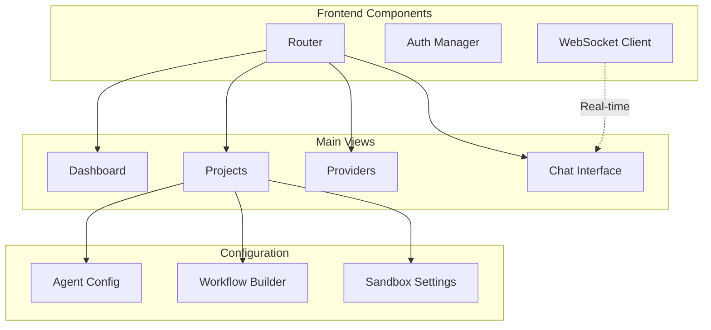

# Phase 6: Web Portal

## Overview
Build the web-based user interface for Code Agent with real-time WebSocket communication.

## UI Architecture


## Component Structure

### Dashboard
- Active sessions
- Recent projects
- Provider status
- Cost metrics

### Project Management
- Project list/grid
- Configuration editor
- Workflow designer
- Sandbox controls

### Chat Interface
- Command input
- Response streaming
- File viewer
- Progress indicators

### Provider Configuration
- Provider list
- Model selection
- API key management
- Connection testing

## Implementation Steps

1. **Frontend Setup**
   - React/Blazor initialization
   - Routing configuration
   - State management

2. **WebSocket Integration**
   - Connection manager
   - Message handling
   - Reconnection logic

3. **Core Components**
   - Layout system
   - Navigation
   - Authentication UI

4. **Feature Views**
   - Dashboard view
   - Projects view
   - Chat interface
   - Settings view

5. **Configuration UIs**
   - Provider manager
   - Workflow builder
   - Agent configurator

## Key Files
- `web/src/App.tsx`
- `web/src/services/WebSocketService.ts`
- `web/src/views/Dashboard.tsx`
- `web/src/views/Chat.tsx`
- `web/src/components/WorkflowBuilder.tsx`

## UI Components
```typescript
interface ChatMessage {
  id: string;
  type: 'command' | 'response';
  content: string;
  timestamp: Date;
}

interface ProjectConfig {
  id: string;
  name: string;
  workflow: WorkflowConfig;
  agents: AgentAssignments;
}
```

## Success Criteria
- [ ] UI renders correctly
- [ ] WebSocket connected
- [ ] Messages streaming
- [ ] Projects manageable
- [ ] Configurations saveable