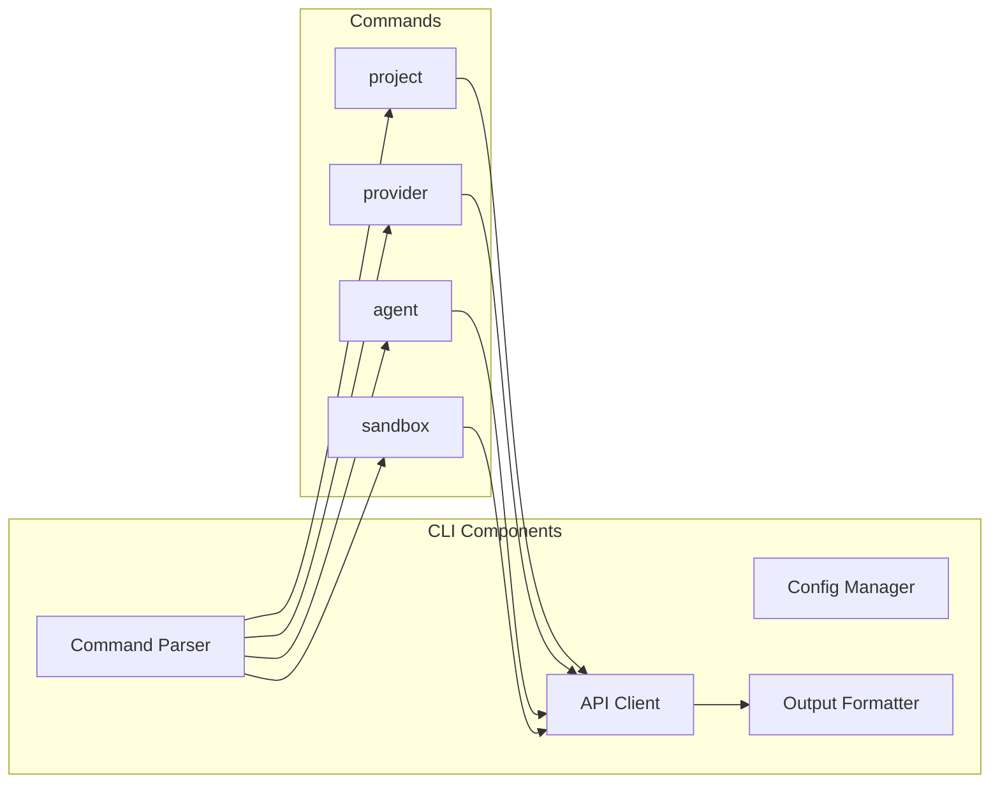

# Phase 7: CLI Tool

## Overview
Develop the command-line interface for Code Agent with full feature parity to web portal.

## CLI Architecture


## Command Structure

### Core Commands
```bash
codeagent [command] [subcommand] [options]

# Project management
codeagent project create <name>
codeagent project list
codeagent project config <id>

# Provider management  
codeagent provider add <type>
codeagent provider test <name>
codeagent provider list

# Agent interaction
codeagent chat
codeagent /plan "Create REST API"
codeagent /code "fibonacci function"

# Sandbox control
codeagent sandbox create <project>
codeagent sandbox exec <project> -- <command>
codeagent sandbox logs <project>
```

### Configuration Commands
```bash
# Global config
codeagent config set <key> <value>
codeagent config get <key>
codeagent config list

# Project config
codeagent project config set <key> <value>
```

## Implementation Steps

1. **CLI Framework**
   - Command parser setup
   - Argument validation
   - Help system

2. **Configuration Management**
   - Config file handling
   - Environment variables
   - Defaults management

3. **API Client**
   - HTTP client
   - WebSocket client
   - Authentication

4. **Command Implementation**
   - Project commands
   - Provider commands
   - Agent commands
   - Sandbox commands

5. **Output Formatting**
   - Table formatter
   - JSON output
   - Progress indicators

## Key Files
- `cli/Program.cs`
- `cli/Commands/ProjectCommand.cs`
- `cli/Services/ConfigManager.cs`
- `cli/Services/ApiClient.cs`

## Interactive Mode
```bash
codeagent interactive
> /plan microservice
Planning microservice architecture...
> /code user controller
Generating user controller...
> exit
```

## Success Criteria
- [ ] Commands parsing correctly
- [ ] Config persisted
- [ ] API communication working
- [ ] Interactive mode functional
- [ ] Output formatted properly