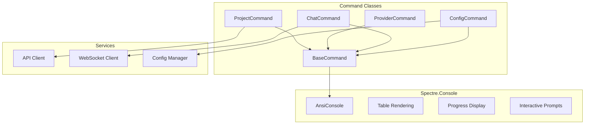

# Phase 7: CLI Tool

## Overview
Develop the command-line interface using Spectre.Console for rich terminal output, with each command and subcommand as separate classes for maintainability.

## CLI Architecture


## Spectre.Console Features

| Feature | Usage in CLI |
|---------|-------------|
| AnsiConsole | Rich text formatting, colors, styles |
| Tables | Formatted data display |
| Trees | Hierarchical information |
| Progress | Multi-task progress bars |
| Prompts | Interactive user input |
| Live Display | Real-time updates |
| Markup | Styled text output |
| Rules | Visual separators |

## Command Class Structure

Each command is a separate class inheriting from BaseCommand:

| Command Class | Subcommands | Purpose |
|--------------|-------------|---------|
| ProjectCommand | create, list, config, delete | Project management |
| ProviderCommand | add, list, test, remove | Provider configuration |
| ChatCommand | (interactive mode) | Agent interaction |
| ConfigCommand | get, set, list, reset | Configuration |
| SandboxCommand | create, exec, logs, stop | Container control |

### Command Organization
```
Commands/
├── BaseCommand.cs          # Abstract base with AnsiConsole
├── Project/
│   ├── ProjectCommand.cs
│   ├── CreateProjectCommand.cs
│   ├── ListProjectsCommand.cs
│   └── ConfigProjectCommand.cs
├── Provider/
│   ├── ProviderCommand.cs
│   ├── AddProviderCommand.cs
│   └── TestProviderCommand.cs
└── Chat/
    └── ChatCommand.cs
```

## Implementation Steps

1. **Spectre.Console Setup**
   - Install Spectre.Console package
   - Configure AnsiConsole
   - Setup markup themes
   - Create base command class

2. **Command Classes**
   - One class per command
   - Inherit from BaseCommand
   - Dependency injection support
   - Async execution

3. **Rich Output**
   - Tables for lists
   - Trees for hierarchies  
   - Progress for long operations
   - Live updates for streaming

4. **Interactive Features**
   - Prompts for user input
   - Selections for choices
   - Confirmations for destructive ops
   - Multi-select for batch operations

5. **Error Handling**
   - Formatted error display
   - Stack trace in debug mode
   - User-friendly messages
   - Suggestions for fixes

## Output Examples

### Table Display
Projects are displayed in formatted tables with colors and borders using AnsiConsole.Table.

### Progress Display  
Long operations show live progress with multiple concurrent tasks using AnsiConsole.Progress.

### Interactive Prompts
User input collected through typed prompts with validation using AnsiConsole.Prompt.

### Error Display
Errors shown with formatted panels, colors, and suggestions using AnsiConsole.Panel.

## Key Files
```
cli/
├── Program.cs                    # Entry point, DI setup
├── Commands/
│   ├── BaseCommand.cs           # Abstract base
│   ├── Project/*.cs             # Project commands
│   ├── Provider/*.cs            # Provider commands
│   └── Chat/*.cs                # Chat commands
├── Services/
│   ├── AnsiConsoleService.cs   # Console abstraction
│   ├── ConfigManager.cs        # Configuration
│   └── ApiClient.cs             # API communication
└── Output/
    ├── TableFormatter.cs        # Table rendering
    └── ProgressReporter.cs      # Progress tracking
```

## Success Criteria
- [ ] Spectre.Console integrated
- [ ] Commands as separate classes
- [ ] Rich formatted output
- [ ] Interactive prompts working
- [ ] Progress indicators functional
- [ ] Error display formatted