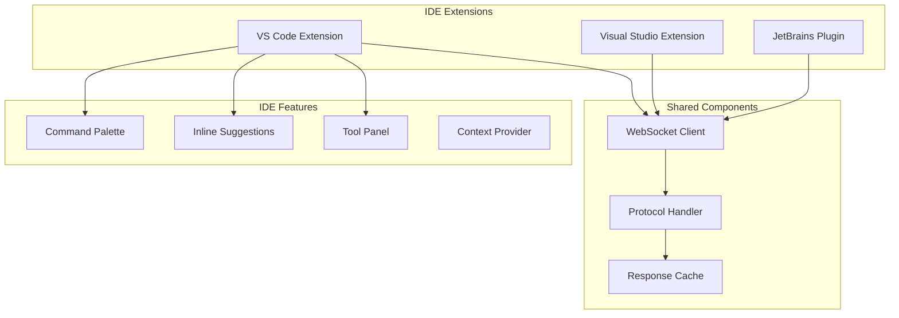

# Phase 8: IDE Extensions

## Overview
Create IDE extensions for VS Code, Visual Studio, and JetBrains IDEs with unified functionality.

## Extension Architecture


## VS Code Extension

### Features
- Command palette integration
- Inline code suggestions
- WebView panel
- Status bar indicator

### Implementation
```typescript
// extension.ts
export function activate(context: ExtensionContext) {
  const client = new CodeAgentClient();
  
  // Register commands
  registerCommand('codeagent.plan', planCommand);
  registerCommand('codeagent.code', codeCommand);
  
  // Setup inline provider
  registerInlineProvider(client);
  
  // Create webview panel
  createWebviewPanel(context);
}
```

## Visual Studio Extension

### Features
- Tool window
- Menu integration
- Solution context
- Quick actions

### Implementation
```csharp
[PackageRegistration]
[InstalledProductRegistration]
public sealed class CodeAgentPackage : AsyncPackage
{
    protected override async Task InitializeAsync()
    {
        await JoinableTaskFactory.SwitchToMainThreadAsync();
        
        // Initialize commands
        await CodeAgentCommand.InitializeAsync(this);
        
        // Setup tool window
        await ToolWindowCommand.InitializeAsync(this);
    }
}
```

## JetBrains Plugin

### Features
- Action system integration
- Tool window
- Intention actions
- Project context

## Implementation Steps

1. **VS Code Extension**
   - Extension scaffolding
   - Command registration
   - WebSocket client
   - UI components

2. **Visual Studio Extension**
   - VSIX project setup
   - Command implementation
   - Tool window
   - Context menus

3. **JetBrains Plugin**
   - Plugin structure
   - Action registration
   - Tool window
   - PSI integration

4. **Shared Library**
   - Protocol implementation
   - WebSocket client
   - Message handling

5. **Testing & Publishing**
   - Extension testing
   - Marketplace preparation
   - Documentation

## Key Files
- `vscode/src/extension.ts`
- `visualstudio/CodeAgentPackage.cs`
- `jetbrains/src/CodeAgentPlugin.java`
- `shared/ProtocolHandler.ts`

## Success Criteria
- [ ] VS Code extension working
- [ ] Visual Studio extension working
- [ ] JetBrains plugin working
- [ ] Commands executing
- [ ] UI rendering correctly