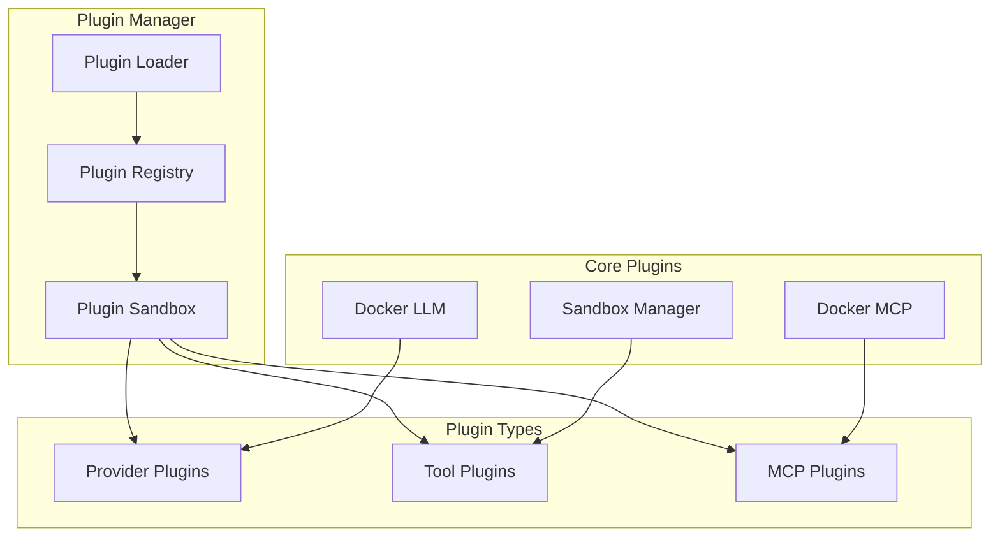

# Phase 9: Plugin System

## Overview
Implement extensible plugin architecture for custom providers, tools, and integrations.

## Plugin Architecture


## Plugin Manifest
```json
{
  "name": "docker-mcp-tools",
  "version": "1.0.0",
  "type": "mcp-provider",
  "main": "index.js",
  "permissions": [
    "docker.access",
    "filesystem.read"
  ],
  "configuration": {
    "docker_socket": {
      "type": "string",
      "default": "/var/run/docker.sock"
    }
  }
}
```

## Plugin Types

### Provider Plugins
- LLM provider adapters
- Custom model integrations
- Specialized providers

### Tool Plugins
- Development tools
- Build systems
- Testing frameworks

### MCP Plugins
- Docker integration
- Container management
- Orchestration tools

## Implementation Steps

1. **Plugin Manager**
   - Plugin discovery
   - Loading mechanism
   - Dependency resolution

2. **Plugin Sandbox**
   - Permission system
   - Resource isolation
   - API restrictions

3. **Plugin Registry**
   - Registration system
   - Version management
   - Conflict resolution

4. **Core Plugins**
   - Docker MCP tools
   - Docker LLM provider
   - Sandbox manager

5. **Plugin API**
   - Hook system
   - Event emitters
   - Service injection

## Key Files
- `Plugins/PluginManager.cs`
- `Plugins/PluginSandbox.cs`
- `Plugins/IPlugin.cs`
- `Plugins/Core/DockerMCP.cs`

## Plugin Development
```csharp
public class CustomPlugin : IPlugin
{
    public string Name => "custom-plugin";
    public string Version => "1.0.0";
    
    public Task InitializeAsync(IServiceProvider services)
    {
        var registry = services.GetService<IProviderRegistry>();
        registry.Register(new CustomProvider());
        return Task.CompletedTask;
    }
}
```

## Success Criteria
- [ ] Plugin loading working
- [ ] Permissions enforced
- [ ] Core plugins operational
- [ ] Plugin configuration saved
- [ ] Hot reload supported