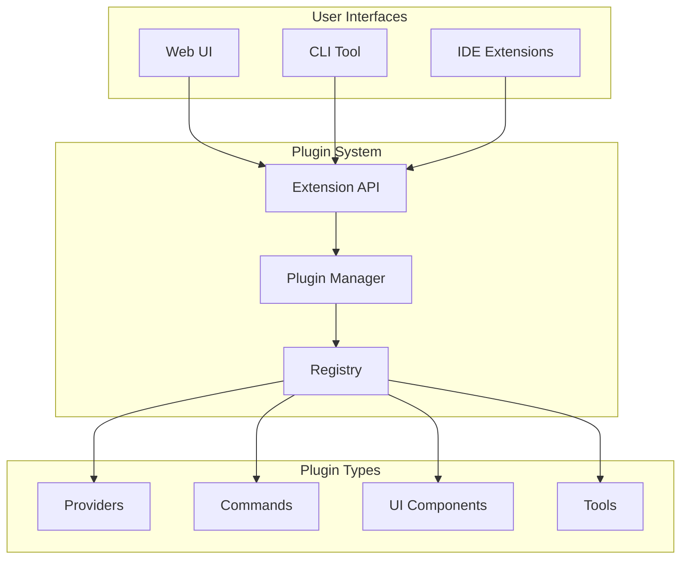

# Phase 9: Plugin System

## Overview
Implement extensible plugin architecture that allows plugins to enhance web UI, CLI commands, and IDE features through a unified extension system.

## Plugin Architecture

## Interface Extensions

### Web UI Extensions
| Extension Point | Plugin Can Add |
|----------------|----------------|
| Navigation | Menu items, sidebar panels |
| Views | Custom pages, dashboards |
| Widgets | Status indicators, toolbars |
| Actions | Context menus, buttons |

### CLI Extensions
| Extension Point | Plugin Can Add |
|----------------|----------------|
| Commands | New top-level commands |
| Subcommands | Extensions to existing commands |
| Flags | Global or command-specific options |
| Output | Custom formatters, filters |

### IDE Extensions
| Extension Point | Plugin Can Add |
|----------------|----------------|
| Commands | Command palette entries |
| Views | Tool windows, panels |
| Providers | Completions, diagnostics |
| Actions | Quick fixes, refactorings |

## Plugin Types

### Provider Plugins
Add new LLM providers or extend existing ones with custom models and capabilities.

### Command Plugins
Add new commands to CLI and IDE command palettes for specialized workflows.

### UI Component Plugins
Provide custom UI elements for web interface and IDE panels.

### Tool Plugins
Integrate development tools, build systems, and testing frameworks.

## Plugin Manifest

Plugins declare their extensions and requirements:

| Field | Purpose |
|-------|---------|
| name | Unique identifier |
| version | Semantic version |
| type | provider, command, ui, tool |
| interfaces | web, cli, ide (which to extend) |
| permissions | Required system access |
| extensions | Specific UI/command additions |

## Implementation Steps

1. **Extension API**
   - Unified interface for all UIs
   - Hook registration
   - Event system

2. **Plugin Manager**
   - Discovery and loading
   - Dependency resolution
   - Version management

3. **Interface Adapters**
   - Web UI adapter
   - CLI adapter
   - IDE adapter

4. **Permission System**
   - Capability-based security
   - User approval flow
   - Sandbox isolation

5. **Core Plugins**
   - Docker integration
   - Additional providers
   - Workflow extensions

## Plugin Examples

### Web UI Plugin
Adds a new dashboard panel showing project metrics and custom actions.

### CLI Plugin
Adds `codeagent deploy` command with cloud provider integrations.

### IDE Plugin Enhancement
Adds inline AI suggestions and custom code actions to existing IDE extensions.

### Cross-Interface Plugin
Single plugin that adds features to all three interfaces simultaneously.

## Key Files
- `Plugins/ExtensionAPI.cs`
- `Plugins/PluginManager.cs`
- `Plugins/Adapters/WebAdapter.cs`
- `Plugins/Adapters/CLIAdapter.cs`
- `Plugins/Adapters/IDEAdapter.cs`

## Success Criteria
- [ ] Plugins can extend web UI
- [ ] Plugins can add CLI commands
- [ ] Plugins can enhance IDE features
- [ ] Permissions enforced
- [ ] Cross-interface plugins work
- [ ] Hot reload supported