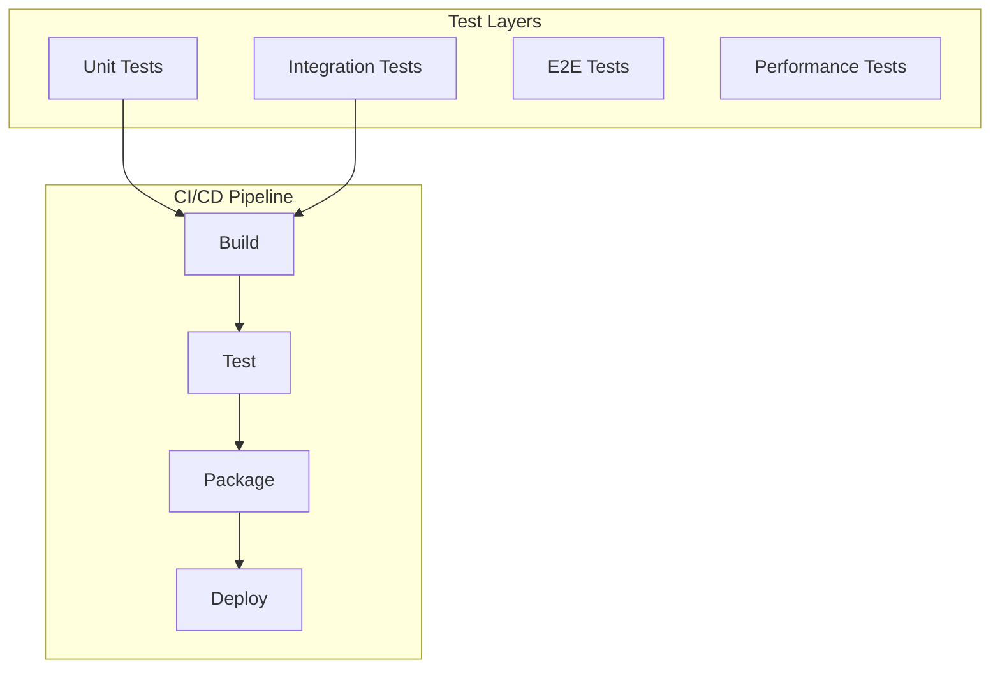

# Phase 10: Testing & Deployment

## Overview
Establish comprehensive testing strategy and deployment pipeline for production readiness.

## Testing Architecture


## Testing Strategy

### Unit Tests
- Provider adapters
- Agent logic
- Message routing
- Configuration management

### Integration Tests
- WebSocket communication
- Docker sandbox
- Provider connections
- Database operations

### End-to-End Tests
- Full workflow execution
- Multi-agent coordination
- UI interactions
- CLI commands

### Performance Tests
- Response time
- Throughput
- Resource usage
- Scalability

## Deployment Configuration

### Docker Compose
```yaml
version: '3.8'
services:
  code-agent:
    image: codeagent/main:latest
    ports:
      - "8080:8080"
    volumes:
      - ./data:/app/data
      - /var/run/docker.sock:/var/run/docker.sock
    environment:
      - LOG_LEVEL=info
```

### CI/CD Pipeline
```yaml
name: Build and Deploy
on:
  push:
    branches: [main]
jobs:
  build:
    runs-on: ubuntu-latest
    steps:
      - uses: actions/checkout@v2
      - name: Build
        run: dotnet build
      - name: Test
        run: dotnet test
      - name: Package
        run: docker build -t codeagent/main:latest .
      - name: Push
        run: docker push codeagent/main:latest
```

## Implementation Steps

1. **Unit Test Suite**
   - Test framework setup
   - Mock implementations
   - Coverage targets

2. **Integration Tests**
   - Test containers
   - API testing
   - WebSocket testing

3. **E2E Test Suite**
   - Selenium/Playwright
   - CLI testing
   - Workflow validation

4. **Performance Testing**
   - Load testing
   - Stress testing
   - Benchmark suite

5. **Deployment Pipeline**
   - GitHub Actions
   - Docker registry
   - Release automation

## Key Files
- `tests/Unit/ProviderTests.cs`
- `tests/Integration/WebSocketTests.cs`
- `tests/E2E/WorkflowTests.cs`
- `.github/workflows/ci.yml`
- `docker-compose.yml`

## Success Criteria
- [ ] 80% code coverage
- [ ] All tests passing
- [ ] CI/CD pipeline working
- [ ] Docker images built
- [ ] Deployment successful