# Code Agent System Architecture Document

## Executive Summary

The Code Agent System is a comprehensive development assistant platform that integrates multiple LLM providers through a unified interface, accessible via web portal, CLI, and IDE integrations. The system leverages Docker containerization, WebSocket communication, and the Model Context Protocol (MCP) to provide a scalable, extensible solution for AI-assisted software development.

## System Overview

### Vision
To provide developers with a seamless, multi-interface code assistant that integrates directly into their existing workflow while maintaining provider flexibility and extensibility.

### Core Principles
- **Provider Agnostic**: Support any LLM through standardized contracts
- **Agent-Specific Configuration**: Each agent type can use different providers/models
- **Project Independence**: Projects copy and maintain their own configurations
- **Multi-Provider Support**: Claude, GPT-4, Gemini, Grok, Mistral, local models
- **Flexible Workflows**: Customizable agent orchestration per project

## Architecture Layers

### Layer 1: Client Interfaces

#### Web Portal
- **Technology**: Blazor Server or React with SignalR
- **Features**: Full code agent interface, project planning, multi-file editing
- **Communication**: WebSocket connection to gateway
- **Authentication**: JWT tokens with refresh capability

#### CLI Tool
- **Technology**: .NET Console Application
- **Platform**: Cross-platform (Windows, Linux, macOS)
- **Command Format**: `/command [args] [prompt]`
- **Configuration**: JSON/YAML based settings

#### IDE Extensions
- **Visual Studio**: VSIX package with tool windows
- **VS Code**: TypeScript extension with Language Server Protocol
- **JetBrains**: Java/Kotlin plugin with IntelliJ Platform SDK
- **Shared Features**: Command palette, inline suggestions, context awareness

### Layer 2: Gateway & Communication

#### WebSocket Gateway
```
Components:
├── Connection Manager
│   ├── Session handling
│   ├── Connection pooling
│   └── Heartbeat monitoring
├── Message Router
│   ├── Command parsing
│   ├── Service routing
│   └── Response aggregation
├── Security Middleware
│   ├── Authentication
│   ├── Authorization
│   └── Rate limiting
└── Protocol Handler
    ├── Message serialization
    ├── Compression
    └── Error handling
```

#### Message Protocol
```json
{
  "id": "unique-message-id",
  "type": "command|response|stream|status|error",
  "timestamp": "2024-01-01T00:00:00Z",
  "payload": {
    "command": "/plan",
    "args": ["microservice", "architecture"],
    "context": {
      "projectId": "proj-123",
      "sessionId": "sess-456"
    }
  },
  "metadata": {
    "version": "1.0",
    "client": "vscode|web|cli",
    "user": "user-id"
  }
}
```

### Layer 3: Core Services

#### Agent Orchestrator Service
**Responsibilities:**
- Command interpretation and routing
- Multi-agent coordination
- Workflow management
- Result aggregation

**Key Components:**
- Command Parser
- Agent Registry
- Workflow Engine
- Result Combiner

#### Context Window Manager
**Responsibilities:**
- Token counting and allocation
- Context prioritization
- History management
- Segmentation strategy

**Segmentation Model:**
```
┌─────────────────────────────┐
│ System Context (5%)         │ - Critical instructions
├─────────────────────────────┤
│ Project Context (15%)       │ - Active project info
├─────────────────────────────┤
│ Recent History (30%)        │ - Conversation context
├─────────────────────────────┤
│ Current Task (40%)          │ - Active work
├─────────────────────────────┤
│ Buffer (10%)                │ - Reserved space
└─────────────────────────────┘
```

#### Project Planning Service
**Features:**
- Task breakdown and estimation
- Dependency tracking
- Progress monitoring
- Architecture design assistance

#### Multi-Agency Coordinator
**Agent Types with Configurable Providers:**
1. **Planning Agent** - Architecture and design
   - Default: Claude 3 Opus (best reasoning)
   - Fallback: GPT-4, Gemini Ultra
   
2. **Coding Agent** - Implementation
   - Default: GPT-4 Turbo (tool use)
   - Fallback: Claude 3 Opus, CodeLlama
   
3. **Review Agent** - Code quality
   - Default: Claude 3 Sonnet (detailed analysis)
   - Fallback: GPT-4, Gemini Pro
   
4. **Testing Agent** - Test generation
   - Default: Gemini Pro (fast, thorough)
   - Fallback: GPT-3.5, Mixtral
   
5. **Documentation Agent** - Doc generation
   - Default: Mistral Large (cost-effective)
   - Fallback: Cohere Command, Grok

**Coordination Flow:**

```mermaid
graph LR
    A[User Request] --> B[Load Project Config]
    B --> C[Select Providers per Agent]
    C --> D[Planning Agent<br/>Claude/GPT-4/Gemini]
    D --> E[Coding Agent<br/>GPT-4/Claude/Local]
    E --> F[Review Agent<br/>Claude/GPT-4]
    F --> G[Testing Agent<br/>Gemini/GPT-3.5]
    G --> H[Documentation Agent<br/>Mistral/Cohere]
    H --> I[Result Aggregation]
    I --> J[User Response]
```


### Layer 4: Provider Management

#### Provider Registry
```csharp
public interface IProviderRegistry
{
    Task RegisterProvider(ILLMProvider provider);
    Task<ILLMProvider> GetProvider(string name);
    Task<IEnumerable<ILLMProvider>> GetAllProviders();
    Task UnregisterProvider(string name);
    event EventHandler<ProviderChangedEventArgs> ProviderChanged;
}
```

#### Provider Contract
```csharp
public interface ILLMProvider
{
    // Identity
    string Name { get; }
    string Version { get; }
    ProviderCapabilities Capabilities { get; }
    
    // Connection
    Task<bool> ConnectAsync(ProviderConfiguration config);
    Task DisconnectAsync();
    bool IsConnected { get; }
    
    // Model Management
    Task<IEnumerable<Model>> GetInstalledModelsAsync();
    Task<PagedResult<Model>> GetAvailableModelsAsync(int page, int pageSize);
    Task<PagedResult<Model>> SearchModelsAsync(string query, int page, int pageSize);
    Task<InstallResult> InstallModelAsync(string modelId, IProgress<InstallProgress> progress);
    
    // Communication
    Task<MCPResponse> SendMessageAsync(MCPMessage message, ProviderContext context);
}
```

#### MCP Protocol Handler
**Message Structure:**
```csharp
public class MCPMessage
{
    public string Id { get; set; }
    public string Type { get; set; } = "tool_use";
    public Dictionary<string, object> Metadata { get; set; }
    public SegmentedContext Context { get; set; }
    public List<MCPTool> Tools { get; set; }
    public SystemInstructions Instructions { get; set; }
}

public class MCPTool
{
    public string Name { get; set; }
    public string Description { get; set; }
    public ToolSchema Parameters { get; set; }
    public ToolExecutor Executor { get; set; }
}
```

### Layer 5: Infrastructure

#### Docker Sandbox Architecture
Each project runs in an isolated Docker container with:
- **Dedicated MCP Agent Executor** inside container
- **File system isolation** with volume mounts
- **Network segmentation** (configurable)
- **Resource limits** (CPU, memory, disk)
- **Security levels** (full isolation to production)

#### Docker Desktop MCP Integration (Beta)
- **Native Docker management** via MCP protocol
- **Container lifecycle control** through agents
- **Docker Compose orchestration** support
- **Direct container command execution**

#### Docker LLM Provider (Beta)
- **Containerized LLM models** with resource isolation
- **GPU passthrough** for acceleration
- **Automatic model container management**
- **MCP-native communication** with Docker LLMs

#### Container Pool Management
```yaml
version: '3.8'
services:
  # Main Code Agent service
  code-agent:
    image: codeagent/main:latest
    ports:
      - "8080:8080"
    volumes:
      - /var/run/docker.sock:/var/run/docker.sock
    environment:
      - DOCKER_MCP_ENABLED=true
      - SANDBOX_ENABLED=true
  
  # Project Sandbox Template
  sandbox-template:
    image: codeagent/sandbox:latest
    profiles: ["sandbox"]
    environment:
      - MCP_MODE=executor
      - PROJECT_ID=${PROJECT_ID}
    volumes:
      - ${PROJECT_PATH}:/workspace
    networks:
      - sandbox-net
      
  # Docker LLM Service
  docker-llm:
    image: docker-llm/gateway:beta
    ports:
      - "8090:8090"
    volumes:
      - /var/run/docker.sock:/var/run/docker.sock
      - llm-models:/models
    deploy:
      resources:
        reservations:
          devices:
            - driver: nvidia
              count: all
              capabilities: [gpu]

networks:
  sandbox-net:
    driver: bridge
    ipam:
      config:
        - subnet: 172.20.0.0/16

volumes:
  llm-models:
```

#### Message Queue Architecture
- **Technology**: RabbitMQ or Azure Service Bus
- **Patterns**: Request-Reply, Pub-Sub, Work Queues
- **Use Cases**: Async operations, multi-agent coordination, event streaming

#### State Management
- **Local SQLite** for data persistence (default)
- **In-memory caching** for performance
- **Optional PostgreSQL** for team deployments
- **File-based configuration** for simplicity

## Security Architecture

### Local Deployment Security
- **No authentication required** for single-user mode
- **Optional basic auth** for team deployments
- **API keys** stored locally in encrypted SQLite
- **All data stays local** - no telemetry unless explicitly enabled

### Provider Credential Management
```csharp
// Simple local credential storage
public class LocalCredentialStore
{
    private readonly string _dbPath = "~/.codeagent/credentials.db";
    
    public async Task StoreApiKey(string provider, string encryptedKey)
    {
        // Store in local SQLite with encryption
    }
}
```

### Optional Multi-User Mode
```yaml
# For small team deployments
environment:
  - ENABLE_AUTH=true
  - AUTH_MODE=basic  # or 'api_key'
  - ADMIN_PASSWORD=changeme
```

## Deployment Architecture

### Local Development
```bash
# Single command startup
docker-compose up -d

# Or for development with hot reload
dotnet watch run
```

### Team Server Deployment
- **Single Docker Compose** for entire stack
- **SQLite** for data persistence (or PostgreSQL for larger teams)
- **Built-in message queue** for async operations
- **Optional authentication** for multi-user scenarios

### Build & Release
```yaml
# Simple GitHub Actions workflow
on:
  push:
    tags:
      - 'v*'
jobs:
  build:
    runs-on: ubuntu-latest
    steps:
      - uses: actions/checkout@v2
      - name: Build Docker image
        run: docker build -t codeagent/main:${{ github.ref_name }} .
      - name: Push to Docker Hub
        run: docker push codeagent/main:${{ github.ref_name }}
      - name: Create Release
        uses: softprops/action-gh-release@v1
```

## Performance Considerations

### Scalability Targets (Local/Team Deployment)
- 10-50 concurrent users (team server)
- 1 user (local development)
- < 500ms command acknowledgment
- < 2s initial response time
- Minimal resource usage on developer machines

### Resource Requirements
- **Local Mode**: 2GB RAM, 2 CPU cores
- **Team Mode**: 4-8GB RAM, 4 CPU cores
- **With Local Models**: +4GB RAM per model

### Optimization Strategies
- Connection pooling
- Response caching
- Context compression
- Lazy loading of providers
- Circuit breaker patterns

## Monitoring & Observability

### Built-in Monitoring
- **Simple health endpoint**: `/health`
- **Basic metrics endpoint**: `/metrics`
- **Log files** in `./data/logs`
- **Optional Prometheus export** for advanced users

### Logging Strategy
```
Levels:
- ERROR: System failures
- WARN: Performance issues
- INFO: User actions (default)
- DEBUG: Detailed flow (development)
```

### Simple Dashboard (Optional)
- Built-in web dashboard at `/dashboard`
- Shows active connections, token usage, response times
- No external dependencies required

## Backup & Recovery

### Simple Backup Strategy
- **Data directory backup**: Copy `./data` folder
- **Configuration backup**: Copy `.env` and `config/` folder
- **SQLite backup**: Automatic daily snapshots
- **Project files**: Already in user's filesystem

### Recovery
```bash
# Stop service
docker-compose down

# Restore data
cp -r backup/data ./data

# Restart
docker-compose up -d
```

## Appendices

### A. Technology Stack
- **Language**: C# (.NET 8)
- **Framework**: ASP.NET Core (minimal APIs)
- **Container**: Docker
- **Database**: SQLite (default) / PostgreSQL (optional)
- **Cache**: In-memory / SQLite
- **UI**: Blazor or React
- **Local Models**: Ollama, LM Studio
- **API Providers**: Anthropic, OpenAI (optional)

### B. API Endpoints
- `/api/v1/providers` - Provider management
- `/api/v1/projects` - Project operations
- `/api/v1/agents` - Agent interactions
- `/ws/v1/connect` - WebSocket connection

### C. Configuration Schema
```json
{
  "providers": {
    "default": "anthropic",
    "configurations": {}
  },
  "gateway": {
    "port": 8080,
    "maxConnections": 1000
  },
  "security": {
    "jwtSecret": "***",
    "tokenExpiration": "1h"
  }
}
```

---
*Document Version: 1.0*  
*Last Updated: [Current Date]*  
*Status: Planning Phase*